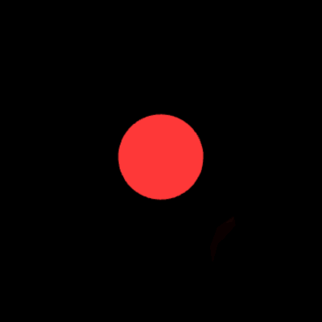
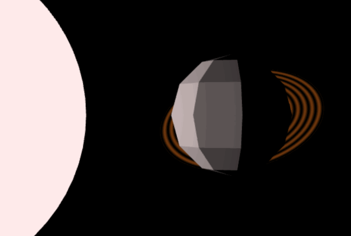
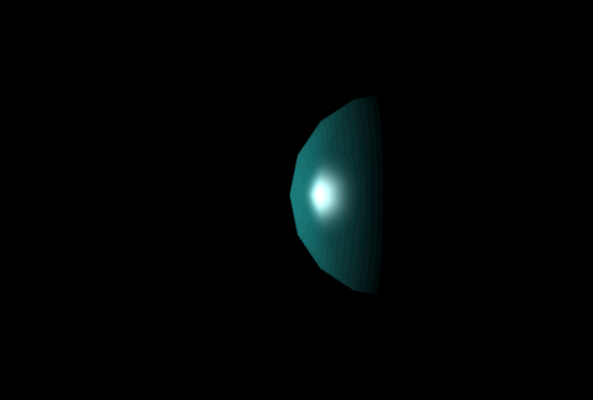
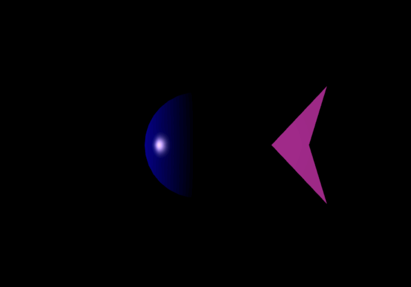
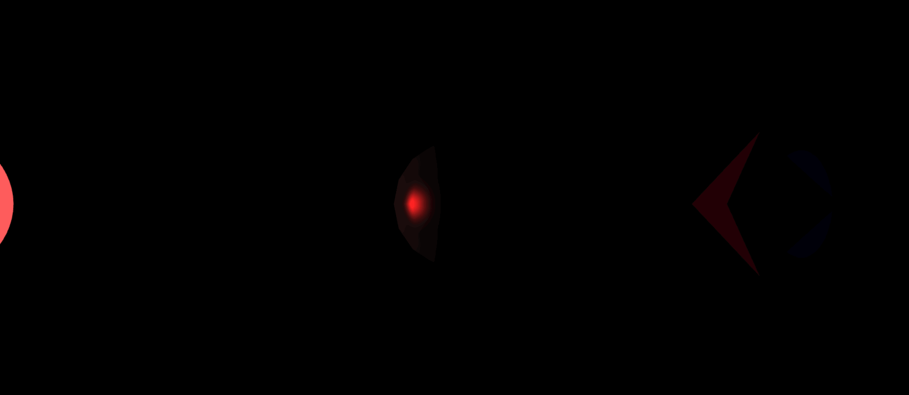

# Assignment 3: Advanced Shader and Planetary Animation

In this assignment, you will expand your understanding of Three.js by working with custom shaders and creating a dynamic planetary system. You will apply advanced techniques for handling lighting and materials using both **Gouraud** and **Phong** shading models. The animation will involve planets with varying properties and interactive user input to manipulate camera views and object behavior.


## Goals

1. **Understand Shading Models in Three.js**  
   Grasp the inner workings of **Gouraud** and **Phong** shading models and how to implement them using custom shaders in Three.js.

2. **Create Custom Shaders and Materials in GLSL**  
   Write custom vertex and fragment shaders using GLSL (OpenGL Shading Language) to implement the desired shading effects.

3. **Animate Objects Using Transformation Matrices**  
   Apply translation, rotation, and scaling matrices to animate objects in 3D space over time.

4. **Implement User Interaction via Keyboard Controls**  
   Allow users to interact with the scene by attaching the camera to different planets and toggling between shading models.

---

## Getting Started

1. **Project Setup**  
   - Open the provided project. The main JavaScript file is `main.js`.
   - The initial scene contains a single sphere in the middle. The camera is located in the position that looks down the entire solar system, and you don't need to make change to that. You will replace the sphere in the middle with the solar system as specified below.

2. **Code Structure**  
   - Familiarize yourself with the functions provided for creating translation and rotation matrices similar to Assignment 2:
     ```javascript
     function translationMatrix(tx, ty, tz) { /* ... */ }
     function rotationMatrixX(theta) { /* ... */ }
     function rotationMatrixY(theta) { /* ... */ }
     function rotationMatrixZ(theta) { /* ... */ }
     ```
   - The `animate()` function contains the main animation loop.

3. **Implementation Notes** 
   - Areas where you need to add or modify code are indicated with comments or `TODO` statements.
   - Feel free to create additional helper functions as needed.

---

## Assignment Tasks and Point Distribution

### 1. Create the Sun and Light Source (3 points)

**a. Animated Sun (2 points)**

- **Create a spherical sun at the origin** using `THREE.SphereGeometry()` with a radius of `1` and segments of `32` for both width and height.
- **Animate the sun's radius and color** over a **10-second period**:
  - **Size Animation**: The sun should swell from radius `1` up to `3` and then back down to `1` in a linear fashion. In other words, the sun should grow linearly for the first 5 seconds and shrink linearly for the next 5 seconds.
  - **Color Animation**: The sun should fade from **red** when it's smallest to **white** when it's largest.
- **Implementation hint**: 
  - For animation, you will need to update the sun's `scale` and `material.color` properties of the mesh object in the `animate()` loop. Use the `clock.getElapsedTime()` function to track time, similar to how you did it in Assignment 2.
  - You can create a auxiliary variable that goes, for example, from 0 to 1 and from 1 to 0 in 10 seconds, and use this variable to update the sun's radius and color. You could reuse this variable for the next section (dynamic light source.)

   

**b. Dynamic Light Source (1 points)**

- **Add a point light source** at the center of the sun using `THREE.PointLight()`.
- **Light Properties**:
  - **Color**: Initialize as white, should be set to sun's current color (updates as the sun changes).
  - **Intensity**: Initial intensity of `1`.
  - **Distance**: `0` (infinite range).
  - **Decay**: `1`.
- **Animate the Light's Power**:
  - The light's `power` should be equal to `10^n`, where `n` is the current sun radius.
  - Update the light's `color` and `power` in sync with the sun.

---

### 2. Create Orbiting Planets (18 points)

**General Requirements (3 points)**

- **Place four planets orbiting the sun**.
- **Planet Specifications**:
  - **Radius**: Each planet should have a radius of `1`.
  - **Orbits**:
    - The innermost planet orbits at a distance of `5` units from the sun.
    - Each subsequent planet orbits `3` units farther out than the previous one.
  - **Orbital Speed**:
    - Each planet revolves around the sun at a speed (angular verlocity) **inversely proportional** to its distance (farther planets move slower), e.g. planet 1 is 5 units away, its speed is 5/5 = 1 rad/s; planet 2 is 8 units away, its speed is 5/8 rad/s, etc.
- **Lighting**:
  - **Ambient Light**: Set the ambient light component of each planet's material to `0`.

**Planet Details**

---

#### **Planet 1: Flat-shaded Gray Planet (2 points)**

- **Geometry**: Use `THREE.SphereGeometry()` with a radius of `1`, width segments of `8`, and height segments of `6`.
- **Material**:
  - **Color**: Gray (`0x808080`).
  - Use `THREE.MeshPhongMaterial()`.
  - Set `flatShading` in the material.
- **Animation**:
  - Set distance of 5 units from the sun, angular velocity of 1 rad/s.


---

#### **Planet 2: Swampy Green-Blue with Dynamic Shading (6 points)**

- **Geometry**: Use `THREE.SphereGeometry()` with a radius of `1`, width segments of `8`, and height segments of `8`.
- **Material Properties**:
  - **Color**: Swampy green-blue (`0x80FFFF`).
  - **Ambient**: No ambient component (`ambient: 0.0`).
  - **Diffuse**: Low diffuse component (`diffusivity: 0.5`).
  - **Specular**: Maximum specular component (`specularity: 1.0`).
  - **Shininess**: Moderate shininess (`smoothness: 40.0`).
- **Shading**:
  - **Apply Phong Shading on Even Seconds**:
    - We already provide a custom **Phong shader** to you, where lighting calculations occur in the fragment shader. Take a look at the GLSL code in the `createPhongMaterial()` function.
    -  **Important**: Remember to update the material uniforms in the animate function using: `updatePlanetMaterialUniforms()` and pass in the planet mesh into it (There is a TODO at the end of the `main.js` for this). Otherwise, you will likely see an 1. Similarly for the material created using `createGouraudMaterial()`.
  - **Apply Gouraud Shading on Odd Seconds**:
    - Implement a custom **Gouraud shader** in `createGouraudMaterial()` where lighting calculations occur in the vertex shader. Refer to the Phong shader's GLSL code, you should only need to add/change a few lines.
- **Implementation Details**:
  - **Shader Switching**:
    - In the `animate()` loop, check the current time and switch the planet's material accordingly. Hint: use `Math.floor(time) % 2` to check for odd or even seconds
  - **Shader Implementation**:
    - Use GLSL to write the shaders in the `createGouraudMaterial()`.
    - For Gouraud shading, perform lighting calculations in the vertex shader and pass the color to the fragment shader via a `varying` variable.


---

#### **Planet 3: Muddy Brown-Orange Planet with Ring (5 points)**

- **Geometry**: Use `THREE.SphereGeometry()` with a radius of `1`, width and height segments of `16`.
- **Material**:
  - Use a the customized Phong material with `createPhongMaterial()` with maximum diffuse and specular components. Pass in the value for the following attributes when creating the Phong material:
  - **Material Properties**:
    - **Color**: Muddy brown-orange (`0xB08040`).
    - **Ambient**: No ambient component (`ambient: 0.0`).
    - **Diffuse**: Maximum diffuse component (`diffusivity: 1.0`).
    - **Specular**: Maximum specular component (`specularity: 1.0`).
    - **Shininess**: Maximum smoothness (`smoothness: 100.0`).

- **Ring**:
  - **Geometry**: Use `THREE.RingGeometry()` with inner radius `1.5`, outer radius `2.5`, and segments `64`.
  - **Custom Shader for Ring**:
    - Implement a shader that applies sinusoidal brightness variations to simulate faded bands like Saturn's rings. You would create a custom shader with `THREE.ShaderMaterial()` and pass in a JavaScript object as a parameter that contains the following:
      - `uniforms`: unifroms should only contain `color` that will be passed in to calculations in the fragment shader.
      - `vertexShader` is implemented already, no need for any change.
      - `fragmentShader`, you will implement the effect of sinusoidal bands here.
      - `side` set to be `THREE.DoubleSide`.
  
  - **Adding Ring to Planet**:
    - Attach the ring to the planet using `planet3.add(ring);` so that the ring's transformation matrix is based directly on the planet's matrix, therefore can move together.
  
- **Wobble Effect (Optional)**:
  - Implement a wobbling rotation by applying rotations around the X and Z axes with angles varying sinusoidally over time.
  - Ensure the ring wobbles together with the planet.
  

---

#### **Planet 4: Soft Light Blue Planet with Moon (2 points)**

- **Geometry**: Use `THREE.SphereGeometry()` with a radius of `1`, width and height segments of `16`.
- **Material**:
  - Use the custom Phong material with high specular component and smoothness.
  - **Material Properties**:
    - **Color**: Soft light blue (`0x0000D1`).
    - **Ambient**: No ambient component (`ambient: 0.0`).
    - **Diffuse**: Maximum diffuse component (`diffusivity: 1.0`).
    - **Specular**: Maximum specular component (`specularity: 1.0`).
    - **Shininess**: Maximum smoothness (`smoothness: 100.0`).
- **Moon**:
  - **Color**: Any color (e.g., pink `0xC83CB9`).
  - **Geometry**: Use `THREE.SphereGeometry()` with a radius of `1`, width segments of `4`, and height segments of `2` (1 subdivision).
  - **Material**: Use `THREE.MeshPhongMaterial()` with flat shading
  - **Orbit**:
    - The moon should orbit around Planet 4 at a distance of `2.5` units.
    - Implement the moon's orbit by applying transformation matrices.


---

### 3. Implement Camera Attachment Functionality (4 points)
In three.js, it is uncommon to directly set a camera transformation matrix. We will instead use the camera.position and camera.lookAt() to control the camera. We provide code for setting the camera to a given planet, but you need to implement the keyboard input with the onKeyDown function.
**a. Camera Controls (3 points)**

- **Keyboard Input**:
  - Implement keyboard controls to attach the camera to different planets.
  - **Key Mapping**:
    - Press `1`: Attach camera to Planet 1.
    - Press `2`: Attach camera to Planet 2.
    - Press `3`: Attach camera to Planet 3.
    - Press `4`: Attach camera to Planet 4.
    - Press `5`: Attach camera to the Moon.
    - Press `0`: Detach camera and return to default view, which is the position (0, 10, 20) looking at the origin (0, 0, 0).
  - **Implementation Details**:
    - Use the `onKeyDown()` function to handle keyboard events.
    - Store the index of the attached object in a variable (e.g., `attachedObject`).
- **Camera Attachment Logic**:
  - In the `animate()` function, check if an object is attached.
  - If attached, update the camera's position to follow the planet smoothly.
    - **Blending Factor**: Use a blending factor (e.g., `0.1`) to interpolate the camera's position for smooth movement (see Smooth Camera Transition section).
    - **Offset**: Add an offset in front of the planet to position the camera (e.g., `translationMatrix(0, 0, 10)`).
  - If camera is detached, revert to the default camera position and enable orbit controls.

**b. Smooth Camera Transition (1 point)**
Once you implemented the key mapping, the code for blending between views is already implemented. All that is left is to implement the case where the camera is detached and the default view is set. Use `camera.position`,  `camera.lookAt`
- **Implement Smooth Transitions**:
  - Instead of snapping the camera to the new position immediately, interpolate between the current position and the desired position using linear interpolation.
  - **Implementation**:
    ```javascript
    camera.position.lerp(desiredPosition, blendingFactor);
    ```
  - **LookAt**:
    - Ensure the camera always looks at the planet it's attached to by updating the target using `camera.lookAt()`.


---

### 4. Apply Transformation Matrices for Animation

- **Planet Movement**:
  - Use transformation matrices to control the position and motion of each planet.
  - **Orbiting**:
    - Apply rotation matrices around the Y-axis to simulate orbiting around the sun.
  - **Self-Rotation and Wobble**:
    - For Planet 3, apply additional rotations around the X and Z axes to create a wobble effect.
- **Moon Orbit**:
  - Implement the moon's orbit around Planet 4 by combining the planet's transformation with the moon's own rotation.

---

## Submission Instructions

Compress (zip) the whole assignment folder into a ZIP format compressed file. Submit it to the Assignment in Bruin Learn where you download this. 

Please make sure you included **everything except the node_modules folder** in the assignment, rather than only the file(s) you made changes. The structure of the compressed file should be the same with the provided assignment material.

---

## Resources

- **Three.js Documentation**: [https://threejs.org/docs/](https://threejs.org/docs/)
- **GLSL Reference**: [https://www.khronos.org/opengl/wiki/Core_Language_(GLSL)](https://www.khronos.org/opengl/wiki/Core_Language_(GLSL))
- **Shader Programming Tutorials**: [https://thebookofshaders.com/](https://thebookofshaders.com/)

---

If you have any questions or need clarification on the assignment, please reach out to your instructor or teaching assistant.

Good luck and have fun exploring the world of shaders and 3D animation in Three.js!