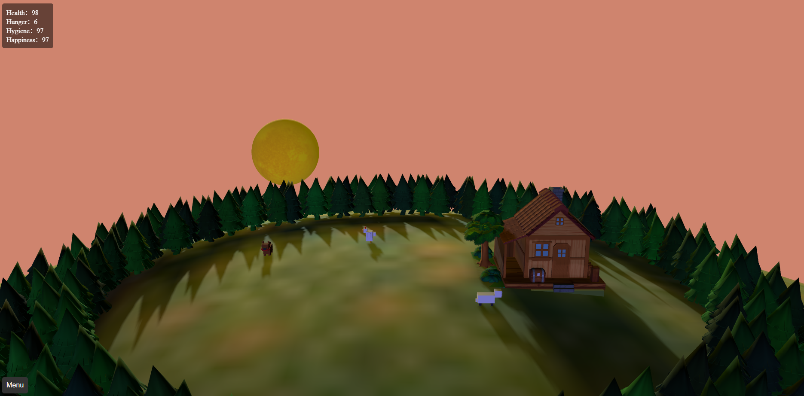

# Petrix - A Digital Pet Matrix

A virtual pet simulation built using **Three.js.** The simulation includes an interactive 3D environment with various animated objects, such as a virtual pet sheep that can perform random actions, display needs icons (e.g., hunger, hygiene, happiness), and has a day-night cycle that dynamically changes the background color.





## Demo / Getting Started

Clone the repository:

```bash
git clone https://github.com/smalex-z/Petrix
```

```bash 
npm init -y
```
We will install `Three.js` and `vite` by running:
```bash
# three.js
npm install --save three

# vite
npm install --save-dev vite

# run
npx vite
```

---

## Controls:

Mouse, Keyboard

You can use the mouse to interact with the pet- open the menu to feed, bathe, or play with the pet.
Use WASD in order to move your selected pet around! The other two pets are controlled by AI.
Using \` will show the bounding boxes of the objects on the screen,

---

## Features
**3D Virtual Pet:** A character that is controlled by the player, and responds to user interactions (feeding, cleaning, playing). Has a bounding box.

**3D AI  Pet:** A character that performs random actions, moves within a defined radius, Also has a bounding box

**Dynamic Status System:** Tracks pet’s life, hunger, hygiene, and happiness, which degrade over time and can be restored by interacting with the pet.
Interactive Needs Icons: Displays icons for the pet’s needs (hunger, hygiene, happiness) above its head, with a blinking effect.

**Day/Night Cycle:** Automatically transitions the background between day and night based on planetary rotations.

**Planets Orbit:** Simulates a simple solar system with planets orbiting a green environment in the background.

**Customizable Controls:** Orbit controls for camera movement, and the option to lock the camera onto planets for a close-up view.

---
## Advanced Features

**Custom shadows/shaders** Shadows are created on every object in the scene. The light is directed from the Sun onto the scene, causing the shadows. The light source moves with the sun, and the shadow across the scene are moved. The moon also reflects the sunlight, creating slight shadows at night too. The shadow of the earth on the moon also creates a nice crecent shape.

**Bounding Box** Every animal in the scene is bound by a Bounding box. This helps prevent collisions (or more accurately, with our code, seperates them from the collision.) The house is the biggest bounding box- no animal or pet is able to enter the bounding box of the house.


---

## Project Structure

```
.
├── assets/
│   ├── css/                # CSS folder
│   ├── images/             # Images Folder
│   ├── stardew_valley_cabin# Imported Cabin Model
│   ├── pine-tree/          # Imported Pine Tree Model
├── JS/
│   ├── pet.js              # Defines the virtual pet object and structure.
│   ├── sceneSetup.js       # Sets up the Three.js scene, camera, renderer, and controls.
│   ├── planets.js          # Creates and manages planets and their orbit animations.
│   ├── status.js           # Manages pet status, icon display, and status update intervals.
│   ├── icons.js            # Creates and positions icons for hunger, hygiene, and happiness.
│   ├── movement.js         # Contains functions for pet movement and action logic.
│   ├── dayNight.js         # Manages the day-night cycle based on planet positions.
│   ├── lighting.js         # Sets up ambient and directional lighting.
│   ├── utils.js            # Contains utility functions for matrix transformations.
│   └── more                # More JS files
├── main.js                 # Main script to manage rendering and animations.
└── index.html              # Main HTML file with controls and canvas for rendering.
```
